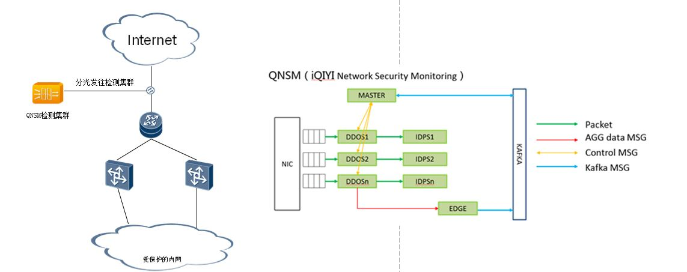

# 简介
QNSM(IQIYI Network Security Monitor) 是一个旁路部署的全流量，实时，高性能网络安全监控引擎，基于DPDK开发，集成了DDOS检测和IDPS模块。

## DDOS检测
DDOS检测功能包括:
- *全流量检测*，可以部署在IDC环境，支持SYN，ACK，RST，FIN，SYNACK，ICMP，UDP FLOOD以及反射攻击(DNS/NTP/SSDP反射...).
- *实时多维度聚合数据*
- *流采样数据*，提供攻击事件未检出后的fall back机制.
- *随时停启的聚合数据输出*
- *数据以json格式输出*，便于数据分析.
- *针对UDP反射攻击，提供DFI/DPI机制*(MEMCACHE，TFTP，CHARGEN，CLDAP，QOTD...).
- *事件过程中dump攻击数据包*.
- *支持IPv4和IPv6*

## IDPS
IDPS模块基于[Suricata](https://github.com/OISF/suricata)，并新增了如下特性，
* 支持lib化编译安装，基于Suricata 4.1.0版本
* 支持事件以Kafka方式输出，提升了事件吞吐量，便于进一步数据分析

## 部署描述


## 架构描述
整体功能模块图如下：


* 基础模块

    包含PORT，CPU 消息、配置文件、表项管理接口、调度框架等基础功能模块。
* 流水线模块

	SESSM：DDOS检测，负责IPv4和IPv6数据包解析，采样FLOW数据聚合，应用层DFI解析，ACL策略下发。
	
	SIP_AGG：DDOS检测攻击源聚合和输出。
	
	VIP_AGG：DDOS检测VIP自学习，数据聚合和输出。
	
	DUMP：DDOS攻击数据包DUMP并保存为pcap文件。
	
	EDGE：类似于broker，输出多维数据至KAFKA。
	
	DETECT：IDPS检测。
* 控制面和工具

	主要包括Master组件以及相关配置文件。
	
	Master负责接收分析中心的攻击事件策略并下发至相应的转发面组件，包含dump数据包，攻击源，攻击源端口，反射攻击proto DFI。
* IDPS管理服务

    FM/FR：IDPS 资源管理和回收
    
    CS：IDPS 统计数据

更多细节参考 [`GUIDE`](./doc/guide.md).

# 快速启动
## 测试环境
测试环境如下：
- Linux Distribution: CentOS Linux release 7.2.1511
- Kernel: 3.10.0-327.el7.x86_64
- CPU: Intel(R) Xeon(R) CPU E5-2650 v4 @ 2.20GHz
- NIC: Intel Corporation 82599ES 10-Gigabit SFI/SFP+ Network Connection (rev 01)
- Memory: 100G+ with two NUMA node.
- GCC: gcc version 4.8.5 20150623 (Red Hat 4.8.5-4)

## 依赖安装
Centos：
```bash
$ yum install -y libpcap-devel pcre-devel file-devel libyaml-devel jansson-devel libcap-ng-devel librdkafka-devel nss-devel nspr-devel make gcc
$ yum install -y libxml2-devel
$ ln -s /usr/include/libxml2/libxml /usr/include/libxml
$ yum install -y  python-pip
$ pip install configparser
```

## DPDK 环境准备

QNSM没有对dpdk版本有特殊要求，我们使用的稳定版本是dpdk-stable-16.11.2。

```bash
$ mkdir -p /opt/qnsm_deps/
$ cd /opt/qnsm_deps/
$ wget https://fast.dpdk.org/rel/dpdk-16.11.2.tar.xz   # download from dpdk.org if link failed.
$ tar vxf dpdk-16.11.2.tar.xz
```

### DPDK 编译安装

```bash
$ cd dpdk-16.11.2
$ export RTE_SDK=`pwd`
$ export RTE_TARGET=x86_64-native-linuxapp-gcc
$ make install T=${RTE_TARGET} DESTDIR=install
```

## 编译

### 下载代码
```bash
$ cd /opt
$ git clone https://github.com/iqiyi/qnsm.git
$ cd qnsm
```
### 运行环境
修改配置文件conf/dpdk_env.cfg，我们这里使用ens7f0和ens7f1两张网卡。
```ini
[NIC1]
name=ens7f0

[NIC2]
name=ens7f1
```

运行环境配置脚本。
```bash
$ python ./scripts/setup_dpdk_env.py conf/dpdk_env.cfg
$ ${RTE_SDK}/tools/dpdk-devbind.py --status

Network devices using DPDK-compatible driver
============================================
0000:06:00.0 '82599ES 10-Gigabit SFI/SFP+ Network Connection' drv=igb_uio unused=
0000:06:00.1 '82599ES 10-Gigabit SFI/SFP+ Network Connection' drv=igb_uio unused=   

$ cat /proc/meminfo | grep Huge
AnonHugePages:   9955328 kB
HugePages_Total:   '11264'
HugePages_Free:        0
HugePages_Rsvd:        0
HugePages_Surp:        0
Hugepagesize:      '2048 kB'
```

### 编译安装IDPS lib

如果已安装IDPS lib，可以跳过该步。

运行`build_idps.sh`脚本，该脚本会安装patch/suricata-4.1.0/0001-IDPS-make-as-a-lib-support-kafka.patch补丁并编译为lib。
```bash
$ cd scripts
$ sh build_idps.sh
$ ls /usr/local/lib
libhtp.a  libhtp.la  libhtp.so  libhtp.so.2  libhtp.so.2.0.0  libsuri.a  libsuri.la  libsuri.so  libsuri.so.0  libsuri.so.0.0.0 
$ ls /usr/local/include/
htp  suricata
```

### 编译QNSM

运行`build_qnsm_lib.sh` shell脚本编译QNSM基础库。
```bash
$ sh build_qnsm_lib.sh 
$ ll $RTE_SDK/$RTE_TARGET/lib/libqnsm_service.a
```

编译qnsm主程序。支持编译成debug或者release版本，默认release版本。debug版本提供一些调试命令用于展示运行时数据。
```
$ cd ..
$ make
$ make install
$ ls /var/qnsm
suricata.yaml  qnsm_edge.xml  qnsm-inspect  qnsm_inspect.cfg qnsm_sessm.xml  qnsm-test  qnsm_vip.xml
```
ddos、idsp、ddos-idps是qnsm支持的三种部署形态，默认以ddos-idps形态安装配置文件；如果以idps形态部署，make install T=idps。

## 配置文件

启动QNSM之前，需要依据[`配置手册`](./doc/configure-tutorial.md)修改`/var/qnsm`安装目录下的配置文件。 

## 启动 QNSM

```bash
$ cd /var/qnsm
$ ./qnsm-inspect -f qnsm_inspect.cfg -c . -p 1
```
* -f 参数指定组件配置文件
* -c 参数指定配置文件目录
* -p 参数指定使用网卡ID的16进制掩码，如果有两张网卡，该值为3（0011），依此类推

另外，可以编写多个部署配置文件（qnsm_inspect_x.cfg），这样的话，可以启动多个QNSM进程。

## 测试QNSM消息接口
QNSM提供多种kafka消息接口接口与外部交互。消息接口格式参考 [`MSG FORMAT`](./doc/msg.md)。

### DDOS检测
#### 数据接口
消费`qnsm_vip_agg`，可以基于VIP粒度实现DDOS检测。

消费`qnsm_sip_agg`，获取DDOS事件的攻击源IP。

消费`qnsm_vip_dport`, `qnsm_vip_sport`，获取VIP源目的端口的流量数据。

消费`qnsm_sample_flow`, 可以基于流采样实现DDOS检测。

#### 控制接口
由于IDC环境带宽大，聚合数据量过大会消耗QNSM本身的资源，因此基于一定策略实现数据输出。

`qnsm_command` topic用于接收策略消息。

以DDOS dump数据包为例，基于事件开始和结束策略实现dump数据包。
```bash
$ ./rdkafka_example -P -t qnsm_command -b xxx-kafka:9092
% Type stuff and hit enter to send
{"id":0,"op":"ip_dump_pkt_enable","content":[{"idc":"idc_aaa","proto":"any","vip":"11.22.33.44","vport":"any"}]}
% Sent 120 bytes to topic qnsm_command partition -1
{"id":0,"op":"ip_dump_pkt_disable","content":[{"idc":"idc_aaa","proto":"any","vip":"11.22.33.44","vport":"any"}]}
% Sent 121 bytes to topic qnsm_command partition -1
```

检查日志
```bash
$ cat qnsm_log_qnsm | grep 'master cmd'
QNSM: 1557921514 master cmd msg {"id":0,"op":"ip_dump_pkt_enable","content":[{"idc":"idc_aaa","proto":"any","vip":"11.22.33.44","vport":"any"}]}
```

检查pcap文件，可以存储在本地或者云端。
```bash
$ cd /data
$ tail -n 20 dump_oss.log 
2019-05-15 Wednesday 19:59:00 INFO dump_oss.py 168 26239 close write file: /data/ads-monitor-mirror/log/11.22.33.44-core4-20190515-1958.pcap 
```

### IDPS事件
消费`nsm_event` kafka topic，进一步实现实时展示和分析事件。
```json
{
    "timestamp":"2019-08-23T17:06:35.284049+0800",
    "flow_id":1854917666668179,
    "event_type":"alert",
    "src_ip":"A.B.C.D",
    "src_port":60013,
    "dest_ip":"78.46.222.60",
    "dest_port":457,
    "proto":"TCP",
    "alert":{
        "action":"allowed",
        "gid":1,
        "signature_id":2024792,
        "rev":4,
        "signature":"ET POLICY Cryptocurrency Miner Checkin",
        "category":"attack_medium",
        "severity":2,
        "metadata":{
            "updated_at":[
                "2018_06_15"
            ],
            "created_at":[
                "2017_10_02"
            ],
            "signature_severity":[
                "Minor"
            ],
            "deployment":[
                "Perimeter"
            ],
            "attack_target":[
                "Client_Endpoint"
            ],
            "affected_product":[
                "Windows_XP_Vista_7_8_10_Server_32_64_Bit"
            ],
            "former_category":[
                "POLICY"
            ]
        }
    },
    "flow":{
        "pkts_toserver":3,
        "pkts_toclient":1,
        "bytes_toserver":401,
        "bytes_toclient":66,
        "start":"2019-08-23T17:06:35.065171+0800"
    },
    "payload_hex":"7B226964223A312C226A736F6E727063223A22322E30222C226D6574686F64223A226C6F67696E222C22706172616D73223A7B226C6F67696E223A2278222C2270617373223A2278222C226167656E74223A22584D5269675C2F322E31332E31202857696E646F7773204E542031302E303B2057696E36343B2078363429206C696275765C2F312E32342E31206D7376635C2F32303137222C22616C676F223A5B22636E5C2F776F77222C22636E5C2F72222C22636E5C2F32222C22636E5C2F31222C22636E5C2F30222C22636E5C2F78746C222C22636E225D7D7D0A",
    "stream":0,
    "host":"sensor-name"
}
```

# 性能测试
由于QNSM转发面基于流水线架构，因此需要平衡各个组件分配的CPU资源。

数据包吞吐可以线性增长，但是瓶颈存在于压力最大的那个组件。

在我们的测试环境中, 开启超线程， DDOS检测和IDPS混合部署，[performance](doc/performance.md)说明了测试方法和数据。

# 版权说明

[License](./LICENSE.md)

# 开源合作

`QNSM` 由 爱奇艺[iQiYi](https://www.iqiyi.com) 安全团队开发. 已经应用网路安全边界控制等多种场景。

作为一个开源项目，欢迎更多的合作和贡献。目前，QNSM 项目除了 iQiYi 部署相关的脚本，代码全部托管在 github 上。我们维护 2 个长线分支：

* master（主干分支）：功能稳定的分支，除了紧急 hot bugfix，不接受直接向该分支提交代码。
* devel（开发分支）：最新的功能会进入该分支，验证稳定后进入 master 分支。

另外，在每次不向前兼容的更新前（比如更新 DPDK 版本），我们会新建一个 LTS 分支，并维护约一年时间。

QNSM 开发合作采用 Git workflow 的工作方式，具体可以参考Contributing文档，我们欢迎更多的开发者的参与和贡献。

* 邮件组: qnsm_devel#qiyi.com (请用@替换#).